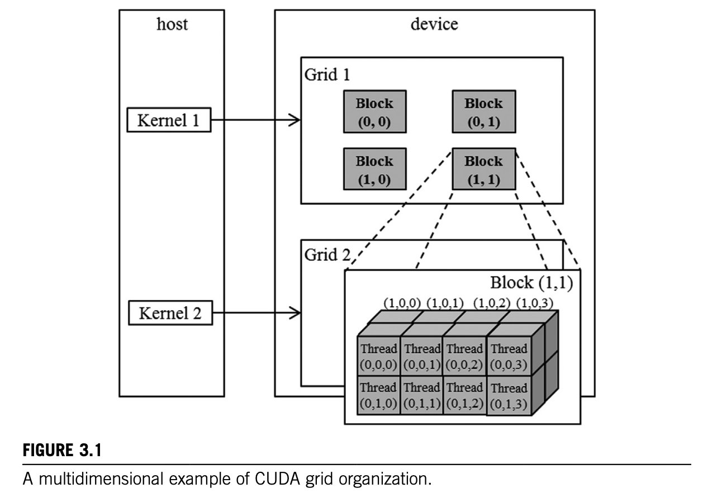

### Chapter 3: Multidimensional grids and data

In CUDA, all threads in a grid execute the same kernel function, and they rely on coordinates, that is, thread indices, to distinguish themselves from each other and to identify the appropriate portion of the data to process. As we saw in Chapter 2, Heterogeneous Data Parallel Computing, these threads are organized into a two-level hierarchy: A grid consists of one or more blocks, and each block consists of one or more threads. All threads in a block share the same block index, which can be accessed via the blockIdx (built-in) variable. Each thread also has a thread index, which can be accessed via the threadIdx (built-in) variable. When a thread executes a kernel function, references to the blockIdx and threadIdx variables return the coordinates of the thread. The execution configuration parameters in a kernel call statement specify the dimensions of the grid and the dimensions of each block. These dimensions are available via the gridDim and blockDim (built-in) variables.



- **CUDA Thread Organization:**
  - Threads are organized in a two-level hierarchy: a grid of blocks, each block containing threads.
  - Each thread has coordinates accessible via built-in variables: `blockIdx`, `threadIdx`.
  - Grid and block dimensions are specified by execution configuration parameters and accessible via `gridDim` and `blockDim`.
  - Both grid and blocks can be 3D arrays: dimensions specified by `dim3` type with fields `x`, `y`, and `z`.
  - Example of 1D grid and block:
    ```cpp
    dim3 dimGrid(32, 1, 1);
    dim3 dimBlock(128, 1, 1);
    vecAddKernel<<<dimGrid, dimBlock>>>(...);
    ```
  - CUDA allows shorthand for 1D configurations by passing a single integer (defaults y and z to 1).

- **Limits and Dimensions:**
  - Maximum threads per block: 1024.
  - Allowed block dimensions examples: `(512,1,1)`, `(8,16,4)`, `(32,16,2)` are valid; `(32,32,2)` is invalid (exceeds 1024).
  - Grid and block dimensionality can differ.

- **Mapping Threads to Multidimensional Data:**
  - Use thread and block indices to map threads to data elements.
  - Example: processing a 2D image of size \( n \times m \) with 2D blocks and grids.
  - Coordinates for pixel processed by a thread:
    \[
    \text{row} = blockIdx.y \times blockDim.y + threadIdx.y
    \]
    \[
    \text{col} = blockIdx.x \times blockDim.x + threadIdx.x
    \]
  - Extra threads may be generated; use if-statements to check bounds.

- **Linearizing Multidimensional Arrays:**
  - Dynamically allocated arrays must be linearized (flattened) into 1D arrays.
  - Row-major layout (C style): element at row \( j \), column \( i \) is at index \( j \times \text{width} + i \).
  - Column-major layout (Fortran style) is not used in CUDA C.
  - Example of accessing a 2D array element in linearized form:
    ```cpp
    int index = row * width + col;
    ```

- **Example: Color to Grayscale Conversion Kernel**
  - Each thread converts one pixel.
  - Grayscale value computed as:
    \[
    L = 0.21 \times r + 0.72 \times g + 0.07 \times b
    \]
  - Access color pixel as 3 consecutive bytes (r, g, b).
  - Kernel snippet:
    ```cpp
    int col = blockIdx.x * blockDim.x + threadIdx.x;
    int row = blockIdx.y * blockDim.y + threadIdx.y;
    if (col < width && row < height) {
      int grayOffset = row * width + col;
      int rgbOffset = grayOffset * 3;
      unsigned char r = Pin[rgbOffset];
      unsigned char g = Pin[rgbOffset + 1];
      unsigned char b = Pin[rgbOffset + 2];
      Pout[grayOffset] = 0.21f * r + 0.72f * g + 0.07f * b;
    }
    ```

- **Image Blur Kernel:**
  - Each output pixel is the average of a patch of surrounding pixels.
  - Patch size defined by `BLUR_SIZE` (radius).
  - Handle boundary conditions by checking if neighboring pixels are within image bounds.
  - Kernel uses nested loops to sum pixel values in the patch and compute average.
  - Example of patch iteration:
    ```cpp
    for (int dy = -BLUR_SIZE; dy <= BLUR_SIZE; dy++) {
      for (int dx = -BLUR_SIZE; dx <= BLUR_SIZE; dx++) {
        int curRow = row + dy;
        int curCol = col + dx;
        if (curRow >= 0 && curRow < height && curCol >= 0 && curCol < width) {
          pixVal += input[curRow * width + curCol];
          pixels++;
        }
      }
    }
    output[row * width + col] = pixVal / pixels;
    ```

- **Matrix Multiplication:**
  - Multiply \( M \) (size \( I \times j \)) and \( N \) (size \( j \times k \)) to produce \( P \) (size \( I \times k \)).
  - Each element \( P_{row,col} \) is the dot product of row \( row \) of \( M \) and column \( col \) of \( N \):
    \[
    P_{row,col} = \sum_{k=0}^{Width-1} M_{row,k} \times N_{k,col}
    \]
  - Map threads to output matrix elements: each thread computes one \( P \) element.
  - Access linearized arrays in row-major order:
    - \( M[row \times Width + k] \)
    - \( N[k \times Width + col] \)
  - Kernel snippet:
    ```cpp
    int row = blockIdx.y * blockDim.y + threadIdx.y;
    int col = blockIdx.x * blockDim.x + threadIdx.x;
    if (row < Width && col < Width) {
      float Pvalue = 0;
      for (int k = 0; k < Width; ++k) {
        Pvalue += M[row * Width + k] * N[k * Width + col];
      }
      P[row * Width + col] = Pvalue;
    }
    ```

- **Summary:**
  - CUDA grids and blocks are multidimensional (up to 3D).
  - Threads identify themselves using `blockIdx` and `threadIdx`.
  - Multidimensional data is often linearized into 1D arrays in row-major order.
  - Proper mapping of threads to data is essential.
  - Examples progress from simple vector addition to image processing and matrix multiplication.

---

If you want, I can also help with the exercises or further explanations!